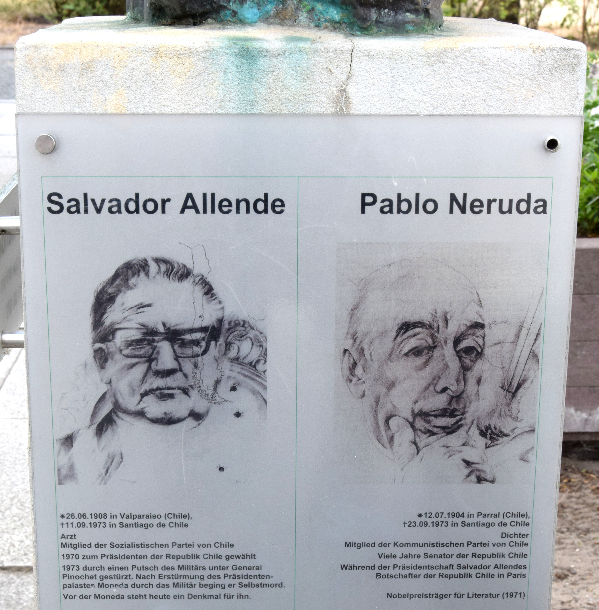
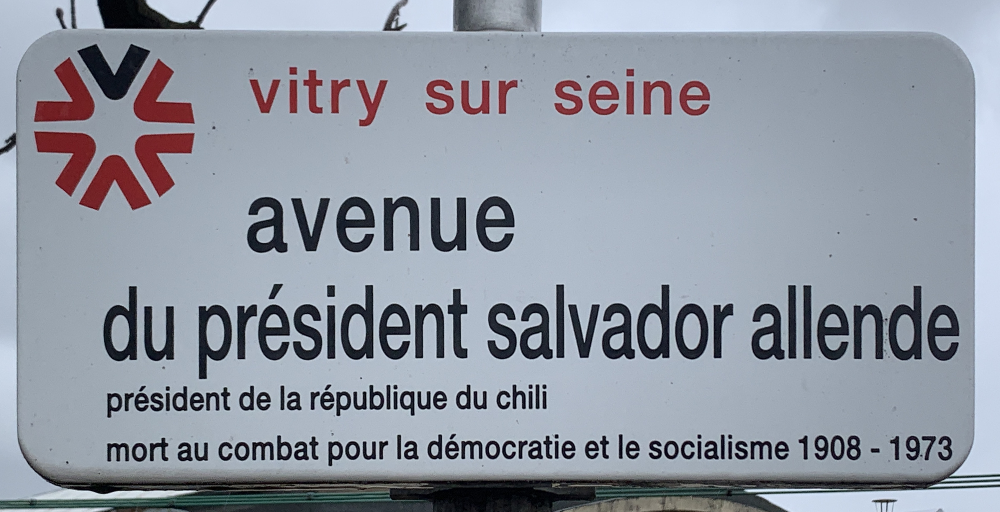
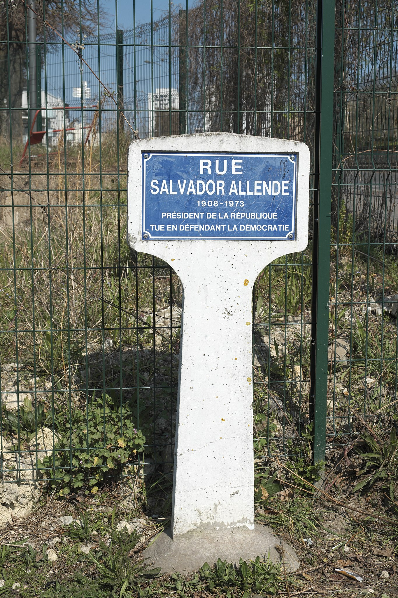
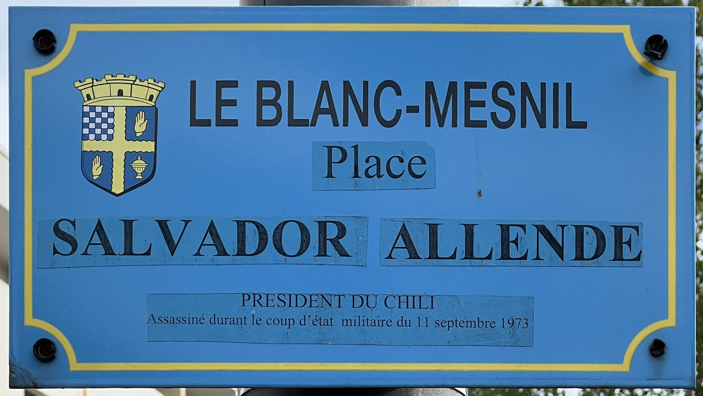
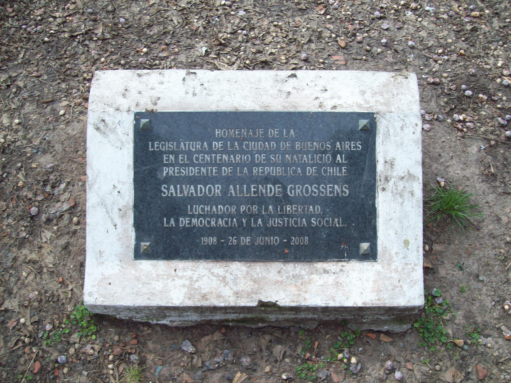
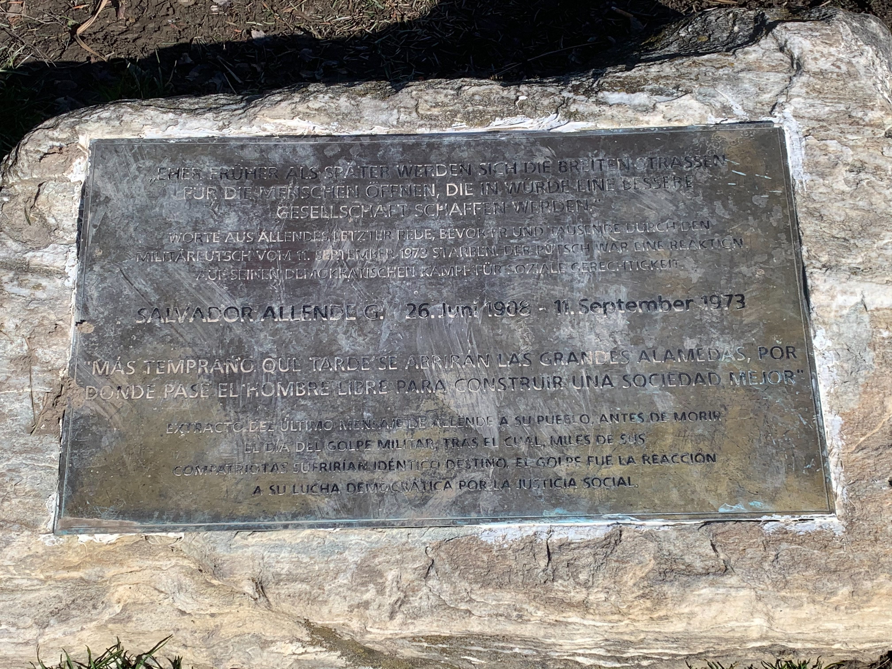
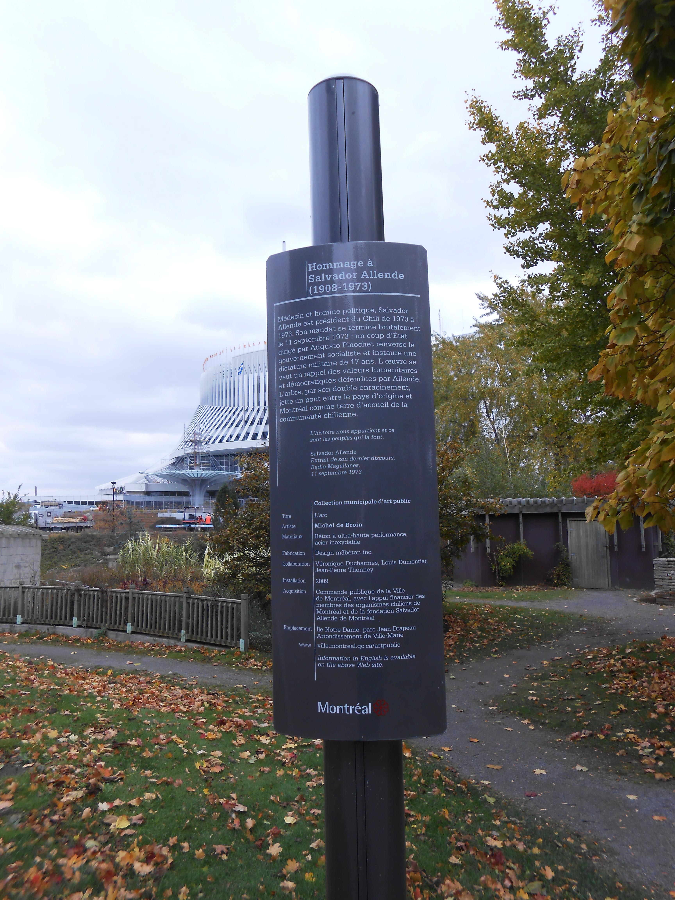

# A Place for Salvador Allende: A Data Investigation

## [Work in progress]

This project seeks to make some sense out of the numerous places that contributors have made known through the website [_Una calle Salvador Allende_](http://www.abacq.org/calle/) ("_A Salvador Allende street_").

Individually, each place has their own story, but when taken together they reveal some insights on where and how Salvador Allende is commemorated around the world. Overall, these places don't just tell something about Allende, but also the people who made these places possible.

⚠ **Content warning: Throughout this investigation there will be references to sensitive topics, including violent means of death. Content warnings like this are provided before the specific sections that refer to these sensitive topics.**

## Who was Salvador Allende and why are places named after him?

First, some notes on the name:

* For English speakers who haven't heard of the name, "Allende" is pronounced like `ah-YEN-deh`.
* Salvador Allende sometimes appears as "**Salvador Allende Gossens**" or "Salvador Allende G." because of naming customs in Spanish-speaking regions like Chile.
  * People in Spanish-speaking regions have two surnames.
  * The first one ("Allende") comes from the father's surname at birth. It's the more commonly used surname and people in Spanish-speaking regions are usually called by their first surname ("Dr. Allende").
  * The second one ("Gossens") comes from the mother's surname at birth. It's not as important as the first surname in daily life. If it is used at all, it's often used along with the first surname for the sake of formality, or to distinguish people with the same given name and first surname. It's also often abbreviated if someone chooses to include it in a name.
  * Because the second surname is the last "word" in a Spanish full name, people who aren't familiar with Spanish naming customs would mistake it for the surname which someone should be called, but in reality people with second surnames are usually not called by their second surnames ("~~Dr. Gossens~~").

Salvador Allende's biography in [Memoria Chilena](https://www.memoriachilena.gob.cl/602/w3-article-799.html) aptly begins with:

> Salvador Allende was the president who attempted to establish socialism in Chile through democratic means.

An English translation of this biography is available [here](texts/salvador_allende_gossens_memoria_chilena_en.md) for those who are looking for a concise biography from a Chilean source. [English Wikipedia](https://en.wikipedia.org/wiki/Salvador_Allende) itself also works too and people can take advantage of the sources used in this article. There is also an equivalent article in the underrated [Simple English version](https://simple.wikipedia.org/wiki/Salvador_Allende) of Wikipedia that is written in a way that those unfamiliar with politics would understand.

### Socialist, democratic, Chilean

Instead of writing yet another biography, this introduction focuses on these three key features of Allende.

* **Socialist**: Allende has been a socialist since his student days. As a socialist, he believed that the gap between the poor and the rich in Chile is unacceptable and this could be eliminated when resources like copper mines and institutions like hospitals are owned by the Chilean state rather than the private sector who also happen to be the richest people. He campaigned for the improvement of the lives of working-class people, and for that he got the support of a lot of them.

* **Democratic**: Socialists around the world have their vocal, wealthy, privileged, and powerful opponents; Chilean socialists like Allende were no exception. This is why Allende had a hard time winning the presidential elections the first three times he tried. Back then, socialists became leaders of their own countries not through elections but through chaotic revolutions. Allende was convinced that he could avoid another chaotic revolution, so he ran again for the presidency in 1970. This time, he became the first democratically elected socialist president in Chile. When he became president, he established and maintained contact with other socialist leaders around the world who recognized that Allende was seeking the same goals as them (socialism) through different means (peaceful democratic processes).

* **Chilean**: Chilean history isn't discussed in a lot of places outside of Chile, like schools and online forums, because what most people call "world history" is actually the history of Europe and the USA. We cannot talk about world history without taking lessons from lesser known countries like Chile. I feel the need to emphasize that Allende was Chilean, because he attempted to make Chilean history from a Chilean perspective and for the benefit of the Chilean people. Non-Chilean (lamentably, privileged American) forces disrupted Chilean history for the worse in an attempt to assert their own version of history, so it is up to Chileans and their sympathizers to reclaim Chilean history and make it part of world history.

### A violent end to a peaceful government

Allende's presidency, which started peacefully in 3 November 1970, ended violently in 11 September 1973 with the [US-backed coup d'état](https://en.wikipedia.org/wiki/1973_Chilean_coup_d%27%C3%A9tat) led by Augusto Pinochet. Instead of resigning as demanded by the coup leaders or taking offers of safe passage to escape the coup alive, Allende delivered his last words to the public and chose to remain in the presidential palace, in the middle of gunshots and explosions, to die as President of Chile.

The military dictatorship that took over the country refused to give him a state funeral that every deceased president deserves. A lot of Chileans, especially Allende's supporters, had to seek exile abroad to save themselves from the human rights violations committed by Pinochet's military dictatorship throughout its rule.

Allende effectively became a taboo topic during the dictatorship, and virtually no one in Chile was able to pay respects to the late president because they either had to escape from Chile or was already killed by accomplices to the dictatorship.

### Long overdue respects

In 1988, Chileans voted against continuing on with a military government in a [historic referendum](https://en.wikipedia.org/wiki/1988_Chilean_national_plebiscite), and in 1990 the country elected its [first democratically elected president in almost two decades](https://en.wikipedia.org/wiki/Patricio_Aylwin). This year, the time was finally right to hold the [state funeral for Allende](https://twitter.com/LaChileanWay/status/1674960526214852608), but some Chileans still thought it wasn't deserved.

Regardless of when or whether the state funeral was held, many people have taken initiatives to pay respects to Allende as soon as after his death. This project proves that most of the initiatives come from outside of Chile thanks to the following interest groups.

## Who are naming places after Salvador Allende?

Outside of Chile, I can identify three interest groups that have been naming and building things in honor of Salvador Allende: socialists, democrats, and Chileans. All three reflect who Allende was, but each interest group has their own reasons to honor Allende, which in turn reflects who they are (or who they think they are).

Notes about images:

* Images used throughout this project come from the file category ["Monuments and memorials to Salvador Allende"](https://commons.wikimedia.org/wiki/Category:Monuments_and_memorials_to_Salvador_Allende) at Wikimedia Commons, an underrated source of free-to-use files. Each file contains a description in English and/or other languages, which helps provide context to the file and this project.
* To minimize copyrighted content in this [free-to-use](/LICENSE) [repository](/MIT_License.txt), there are links to each place with photos and details (usually in Spanish, the main language used in _Una calle Salvador Allende_).

### Socialists (regardless of whether they uphold peaceful democratic values or not)

Although socialist-aligned leaders around the world share the same goals, they differ in their means to achieve them. The means used throughout history had been unpleasant, and this is where Allende wanted to differ. There are brief historical information about each example country to compare them to the peaceful and democratic way in which Allende pursued socialist goals.

#### **Former Soviet Russia (and the Soviet Union)**

_[[ID 172](http://www.abacq.org/calle/index.php?2008/06/30/214-moscu-rusia)] улица Сальвадора Альенде / ulitsa Sal'vadora Al'yende at Moscow, Russia_

[Soviet Russia](https://en.wikipedia.org/wiki/Russian_Soviet_Federative_Socialist_Republic) was the center of the former Soviet Union, and Moscow was the capital of both Soviet Russia and Soviet Union. In 1973, Soviet Russian public organizations recommended to rename Moscow's 7th Sandy Street (7-я Песчаная улица) to [Salvador Allende Street](https://ru.wikipedia.org/wiki/ru:%D0%A3%D0%BB%D0%B8%D1%86%D0%B0%20%D0%A1%D0%B0%D0%BB%D1%8C%D0%B2%D0%B0%D0%B4%D0%BE%D1%80%D0%B0%20%D0%90%D0%BB%D1%8C%D0%B5%D0%BD%D0%B4%D0%B5?uselang=en). This street still carries Allende's name today, and the original memorial plate located at 1 Salvador Allende Street still remains as of May 2021 according to [Google Street View](https://goo.gl/maps/FtSoreDJD2VpteQL6).

Soviet Russia was established after the end of the Russian Empire and an armed revolution in 1917 that overthrew the short-lived provisional government that sought to follow. It became the world's first constitutionally socialist state. Opposition forces armed themselves against the revolution leaders, so the revolution escalated into a civil war. To win the civil war, Soviet Russia took most territories that belonged to the former Russian Empire, turned them into their own "independent" states, and grouped Soviet Russia and these states into the [Soviet Union](https://en.wikipedia.org/wiki/Soviet_Union).

The economy of the Soviet Union was highly centralized and state-planned. Its economy progressed to the detriment of laborers in the union's extensive forced labor camps. One of Soviet Union's leaders, Joseph Stalin, implemented a Great Purge to eliminate political opponents and anyone else who was a threat to his power, to the point of literally erasing them out of photos with Stalin (see a sample photo [before](https://en.wikipedia.org/wiki/File:Nikolai_Yezhov_with_Stalin_and_Molotov_along_the_Volga%E2%80%93Don_Canal,_orignal.jpg) and [after](https://en.wikipedia.org/wiki/File:Stalin_and_Molotov_along_the_Volga%E2%80%93Don_Canal,_Nikolai_Yezhov_removed.jpg) the purge).

The Soviet Union and its allied countries were the representative of socialism and communism during the Cold War, which was not an armed war in itself but rather a series of competitions between socialist/communist interests and capitalist interests represented by the USA and its Western allies. Allende's government saw itself stuck in this political climate—the USA saw the socialist tendency of Allende's government as a threat to its interests, hence one of the "competitions" of the Cold War was fought in Chile.

Government-led reform within Soviet Russia (in an effort to save its economic and political system), separatist movements within the Soviet Union, and the overthrow of socialist/communist one-party governments in the Soviet Union's allied countries led to the Soviet Union's dissolution. Capitalist interests won in the Cold War, but not without violent means to suppress perceived threats such as Allende's government.

#### **Former East Germany**

_[[ID 286](http://www.abacq.org/calle/index.php?2009/11/08/436-berlin-alemania)] Salvador-Allende-Straße at Berlin-Köpenick, Germany ([Photo](https://commons.wikimedia.org/wiki/File:Bundesarchiv_Bild_183-M1103-0013,_Berlin,_Pablo-Neruda-Stra%C3%9Fe,_Salvador-Allende-Stra%C3%9Fe.jpg) by Bundesarchiv, Bild 183-M1103-0013, CC-BY-SA 3.0)_

Residents of the workers' quarters in Berlin-Köpenick, which was then part of East Germany, voted to name two intersecting streets after Salvador Allende and [Pablo Neruda](https://en.wikipedia.org/wiki/Pablo_Neruda), a Chilean poet, Nobel Prize laureate, and important ally of Allende who died a few days after the coup d'état. The street names were officially given on 3 November 1973, which would have marked three years since Allende took office as president.

⚠ **Content warning: the following photo and quotation from the biography plate contains references to suicide.**

_[[ID 287](http://www.abacq.org/calle/index.php?2012/07/19/575-berlin-alemania)] Bust of Salvador Allende by Dietrich Rohde at Berlin-Köpenick, Germany ([Photos](https://commons.wikimedia.org/wiki/File:Bust_Salvador_Allende_by_Dietrich_Rohde_in_Berlin_01.jpg) by Singlespeedfahrer, CC0 Public Domain. Photo of the biography plate cropped from the [original](https://commons.wikimedia.org/wiki/File:Bust_Salvador_Allende_by_Dietrich_Rohde_in_Berlin_02.jpg).)_

A bronze bust of Salvador Allende was installed in 1981 and is currently located at Salvador Allende corner Pablo Neruda streets. There is a plate under the bust that provides brief biographies of the two Chileans.

> **Salvador Allende**
>
> Born 26 June 1908 in Valparaiso (Chile),
>
> Died 11 September 1973 in Santiago de Chile
>
> Physician
>
> Member of the Socialist Party of Chile
>
> Elected President of the Republic of Chile in 1970
>
> Overthrown during a military coup d'état led by General Pinochet. After the military stormed the La Moneda presidential palace, Allende died by suicide.
>
> Today a monument to Allende stands in front of La Moneda.
>
> **Pablo Neruda**
>
> Born 12 July 1904 in Parral (Chile),
>
> Died 23 September 1973 in Santiago de Chile
>
> Poet
>
> Member of the Communist Party of Chile
>
> Senator of the Republic of Chile for many years
>
> Ambassador of the Republic of Chile in Paris during Salvador Allende's presidency
>
> Nobel Prize laureate for Literature (1971)

[East Germany](https://en.wikipedia.org/wiki/East_Germany) existed from 1949 to 1990 and was a one-party state founded and governed by a socialist-aligned political party. When faced with an increasing number of skilled people leaving the country and weakening the economy, the government responded with building the Berlin Wall and violent means to keep people inside the country: landmines and traps were built around the wall, and border guards either killed people attemtpting to leave or captured them as long-term prisoners.

Peaceful protests influenced the fall of the Berlin Wall, multi-party free and fair elections in East German states, the reunification of East Germany and West Germany into today's Germany, and the prosecution of former East German leaders for crimes against their own people.

#### **Hungary**

_[[ID 157](http://www.abacq.org/calle/index.php?2009/07/15/363-budapest-hungria)] Salvador Allende memorial stone located within a park with the same name at Budapest, Hungary ([Photo](https://commons.wikimedia.org/wiki/File:Salvador_Allende-eml%C3%A9kk%C5%91,_2018_Kelenf%C3%B6ld.jpg) by Globetrotter19, CC BY-SA 3.0)_

> Dr. Salvador Allende
>
> 1908 - 1973
>
> In memory of the President of the Republic of Chile, who died a martyr's death in the struggle for the socialist rise of his people
>
> Erected by the Budapest City Council
>
> 1973

The Budapest City Council approved the erection of this memorial stone in 24 October 1973. The apartments around the [park](https://commons.wikimedia.org/wiki/Category:Allende_park,_Budapest) were built in the early 1970's by the Hungarian Young Communist League, which was attached to the then ruling socialist-aligned party of Hungary which gained power by suppressing opposition parties.

[Hungary](https://en.wikipedia.org/wiki/Hungarian_People%27s_Republic) was a one-party state from 1949 to 1989 with tight control from the Soviet Union, which violently repressed a people's revolution in 1956, killed thousands of Hungarians, and forced thousands more into exile.

The new goverment which the Soviet Union installed after the revolution grew to become less restrictive of people's freedoms and more welcoming of products from outside the Soviet Union, though the country remained a one-party Soviet-aligned state. This context made it easier for Hungary to transition into multi-party democracy after the Soviet Union's dissolution. To mark this transition, the country symbolically reburied the victims of the 1956 revolution in June 1989.

#### **Cuba**

_[[ID 132](http://www.abacq.org/calle/index.php?2011/08/23/530-la-habana-cuba)] Avenida Salvador Allende at Havana, Cuba_

_[[ID 129]((http://www.abacq.org/calle/index.php?2007/07/17/90-monumento-a-salvador-allende-cuba))] Monument to Salvador Allende by Mónica Bunster at Havana, Cuba_

In Havana, capital of Cuba, Avenida Carlos III was renamed to Avenida Salvador Allende in October 1973, though [OpenStreetMap](https://www.openstreetmap.org/way/23860167) and [Google Maps](https://goo.gl/maps/CfjwCeYfvvFJM6jg9) show both names to refer to the same avenue.

Nearby, there is a monument to Salvador Allende located at a park in Calle 23 corner Calle G (a.k.a. Avenida de los Presidentes). This monument was inaugurated in 2000 and is one of the four replicas of the original monument by Chilean artist Mónica Bunster located at Palmilla, Chile [[ID 25](http://www.abacq.org/calle/index.php?2008/07/01/216-la-palmilla-chile)]. It is a half-body bust of Allende wearing a professional suit without a tie, looking up and waving the right hand up high.

The other three replicas are in Castuera, Spain [[ID 357](http://www.abacq.org/calle/index.php?2007/09/11/93-castuera-espana)]; Gijón, Spain [[ID 360](http://www.abacq.org/calle/index.php?2007/03/21/63-gijon-espana)]; and at the University of Guadalajara in Mexico [[ID 213](http://www.abacq.org/calle/index.php?2007/02/18/43-universidad-de-guadalajara)], where Allende spoke the following quote in front of students on 2 December 1972.

> Being young and not being revolutionary is a contradiction at a biological level.

As for [Cuba](https://en.wikipedia.org/wiki/Cuba), it is currently one of the few remaining one-party socialist states in the world. The current government gained power through an elaborate armed revolution that lasted from 1953 to 1959. The revolution's leader, Fidel Castro, set himself up as the country's leader. Castro implemented a planned economy and nationalized industries according to socialist goals, but also banned political opposition and took full control of the press such that practically all news and information in Cuba comes from the one-party government.

Allende's government (re)established diplomatic relations with Cuba, a strong ally despite the differences in the means to achieve socialism. Castro held an official visit to Chile in 1971, and Allende held an official visit to Cuba in 1972. History says that Castro gifted Allende an AK-47 rifle; this rifle would become relevant in another section of this investigation.

### Advocates of democracy (regardless of whether they're outwardly socialist or not)

There has always been a significant opposition against socialist movements because historical socialist governments like the ones previously mentioned have been associated with violent forms of gaining and maintaining power, coercive measures such as forced labor that disrespect human autonomy, the suppression of all forms of opposition and criticism including well-meaning ones, and the suppression of human freedoms such as the right to migrate.

Allende was a socialist politician who gained power through free and fair elections (even if it took him four times) and maintained power without suppressing opposition, criticism, or human freedoms. However, his government was violently overthrown by forces who failed to disassociate Allende from the oppressive socialist governments in other countries.

Making such disassociation allows advocates of democracy, socialist or otherwise, to honor Allende as a faithful servant of citizen-led democracy and to condemn violence as a means to suppress opposition and perceived threats.

#### **France**

France's national foreign policy during Allende's presidency was unremarkable in the context of this investigation, because [its government](https://en.wikipedia.org/wiki/Georges_Pompidou) sought to maintain independence through its relations with both the Soviet Union and the USA. France would also elect a [president](https://en.wikipedia.org/wiki/Fran%C3%A7ois_Mitterrand) from its Socialist Party only in 1981.

In this context, the existence of numerous places in France named after Allende is better explained by efforts at the municipal level, depending on whether a municipal government is socialist-aligned, honoring Allende's democratic efforts, condemning the violent coup that overthrew Allende, and/or sympathetic towards Chilean refugees who had to escape the military dictatorship that followed the coup.

_[[ID 717](http://www.abacq.org/calle/index.php?2008/11/05/281-argenteuil-francia)] Esplanade Salvador Allende at Argenteuil, France_

The place in the dataset that was named after Salvador Allende the earliest is located at Argenteuil, France, where the municipal council at that time unanimously agreed to name a street after Salvador Allende as early as three days after the coup. The official announcement (full text below) used an anti-imperialist and pro-worker tone that is commonly seen in socialist-aligned messages, but also mentioned the legal and democratic nature of Allende's socialist government.

> **A _President Salvador Allende_ Street in Argenteuil**
>
> A military coup had just deposed the legal Popular Unity government in Chile.
>
> Reactionary forces with the help of multinational copper and telephone companies, supported by United States imperialism, violated the legality, suppressed liberties, and provoked a civil war to reclaim their privileges.
>
> A bloody repression arises over the democratic workers' movement.
>
> There are already thousands of victims.
>
> One of the first victims was the President of the Republic Salvador Allende.
>
> The Municipal Council in its public session on 14 September 1973 gave a respectful tribute to this brave and determined militant who died in combat and who will remain the symbol of Popular Unity.
>
> To immortalize his memory and highlight the solidarity of the inhabitants of Argenteuil towards the people of Chile, the Municipal Council unanimously decided to name the new street in the city center, which connects Rue de la Liberté to Rue du 8 Mai 1945, after President Salvador Allende.

Not all places in France named after Salvador Allende kept the name, and the main factor is, ironically but expectedly, driven by routine democratic elections at the municipal level. After winning elections, some right-wing anti-socialist municipal governments took out Allende's name from streets, parks, and other public spaces. One right-wing municipal mayor even [justified](http://www.abacq.org/calle/index.php?2007/02/18/4-levallois-perret-francia) the renaming of a street from Salvador Allende to another name by saying "Pinochet saved Chile from chaos".

Among those places that kept Salvador Allende's name, there is often an emphasis on Allende's death for the sake of democracy and/or socialism, in the face of fascist adversaries who chose to fight with violence. The portrayal of Allende's death is typically dramatic, if not graphic, to evoke the idea of martyrdom.

⚠ **Content warning: the following photos and place signage translations contain references to murder and implied suicide.**

_[[ID 474](http://www.abacq.org/calle/index.php?2008/07/24/241-gaillon-francia)] Place Salvador Allende at Gaillon, France_

Salvador Allende park at Gaillon was inaugurated in 1980 and has a bust of Allende made by Chilean artist José Edulio Barrientos. The inscription below the bust says:

> Salvador Allende
>
> 1908 - 1973
>
> President of the Republic of Chile
>
> Died so that democracy may live

_[[ID 86](http://www.abacq.org/calle/index.php?2013/11/15/619-poitiers-francia)] Rue Salvador Allende at Poitiers, France_

Salvador Allende Street at Poitiers was inaugurated on 5 November 1978 and this descriptive biography was installed just below the street sign in a commemorative ceremony on September 2013, 40 years after the coup.

> Salvador Allende (1908-1973)
>
> President of the Republic of Chile from 1970 to 1973 who responded to the aspirations of the majority of the Chilean people by installing the Popular Unity government. Important reforms were done with the strictest respect for legality.
>
> Overthrown on 11 September 1973 by a military coup d'état, President Allende died with a weapon on hand inside the presidential palace which was bombed by air strikes. His socialist ideal, his bravery and his dignity serve as an example for democrats around the world.

_[[ID 694](http://www.abacq.org/calle/index.php?2009/12/01/430-vitry-sur-seine-francia)] Avenue du Président Salvador Allende at Vitry-sur-Seine, France ([Photo](https://commons.wikimedia.org/wiki/File:Plaque_Avenue_Pr%C3%A9sident_Salvador_Allende_-_Vitry-sur-Seine_(FR94)_-_2021-03-17_-_1.jpg) by Chabe01, CC BY-SA 4.0)_

> Vitry sur Seine
>
> President Salvador Allende Avenue
>
> President of the Republic of Chile
>
> Died in combat for democracy and socialism 1908 - 1973

_[[ID 740](http://www.abacq.org/calle/index.php?2007/12/11/131-saint-ouen-l-aumone-francia)] Rue Salvador Allende at Saint-Ouen-l'Aumône, France ([Photo](https://commons.wikimedia.org/wiki/File:Saint-Ouen-l%E2%80%99Aum%C3%B4ne_(95)_Rue_Salvador_Allende_426.jpg) by GFreihalter, CC BY-SA 4.0)_

> Salvador Allende Street
>
> 1908-1973
>
> President of the Republic
>
> Killed while defending democracy

_[[ID 699](http://www.abacq.org/calle/index.php?2009/09/13/398-le-blanc-mesnil-francia)] Place Salvador Allende at Le Blanc-Mesnil, France ([Photo](https://commons.wikimedia.org/wiki/File:Plaque_Place_Salvador_Allende_-_Le_Blanc-Mesnil_(FR93)_-_2022-08-21_-_1.jpg) by Chabe01, CC BY-SA 4.0)_

> Le Blanc-Mesnil
>
> Salvador Allende Park
>
> President of Chile
>
> Assassinated during the military coup d'état on 11 September 1973

_[[ID 711](http://www.abacq.org/calle/index.php?2009/03/05/332-montreuil-francia)] Avenue du Président Salvador Allende at Montreuil, France ([Photo](https://commons.wikimedia.org/wiki/File:Plaque_Avenue_Pr%C3%A9sident_Salvador_Allende_-_Montreuil_(FR93)_-_2020-10-23_-_2.jpg) by Chabe01, CC BY-SA 4.0)_

> Montreuil
>
> President Salvador Allende Avenue
>
> President of the Unity Government of Chile
>
> Assassinated by the Chilean fascists on 11 September 1973

#### **Catalonia**

_[[ID 335](http://www.abacq.org/calle/index.php?2010/09/03/500-rubi-espana)] Plaça de Salvador Allende at Rubí_

In this park at Rubí named after Salvador Allende, there is a [dedication stone](https://monuments.iec.cat/fitxa.asp?id=366) made of marble that reads:

> This park symbolizes the effort of ex-president Salvador Allende to preserve the rights and freedoms of the Chilean people
>
> Rubí, 14 November 1999

_[[ID 312](http://www.abacq.org/calle/index.php?2011/09/09/538-valls-espana)] Monument to Salvador Allende at Plaça de l'Estació in Valls ([Photo](https://commons.wikimedia.org/wiki/File:015_Monument_a_Salvador_Allende,_pl._de_l%27Estaci%C3%B3_(Valls).jpg) by Enric, CC BY-SA 4.0)_

> The City of Valls
>
> to Salvador Allende
>
> President of Chile 1970-1973
>
> Valls, 16 September 2010

_[[ID 339](http://www.abacq.org/calle/index.php?2009/10/25/425-barcelona-espana)] Plaça de Salvador Allende at Barcelona_

_[[ID 359](http://www.abacq.org/calle/index.php?2007/07/09/82-barcelona-espana)] "A Salvador Allende" ("To Salvador Allende") by Lautaro Díaz at Barcelona ([Photo](https://commons.wikimedia.org/wiki/File:Altre_11_de_setembre.jpg) by Xaxat, CC BY-SA 3.0 Spain)_

![Photo of the bust "A Salvador Allende" by Lautaro Díaz located within Salvador Allende Park at Barcelona. The bust, composed of Allende's head and neck, is installed jutting off from a bronze plaque with an inscription above the bust (translation of the inscription follows). On the side of the bust, to the viewer's left, there is the Chilean flag and an outline of South America with Chile's borders emphasized. The whole bronze plaque containing these features is placed over a bigger vertical steel sheet so that the plaque could be mounted on the park's wall. Spanning across the vertical steel sheet, below the bronze plaque, and mounted on the wall is a large horizontal dedication plaque that says "A Salvador Allende" ("To Salvador Allende"). Carme Grandas writes in the online catalog of public art in Barcelona: "The head is sculpted in strong, bold, even brutal strokes, appropriate for the person it depicts, his manner of death, and for the work itself."](assets/359_Spain_Barcelona_A-Salvador-Allende.jpg)

> TO SALVADOR ALLENDE
>
> "History is ours and is made by the people"
>
> SALVADOR ALLENDE GOSSENS 1908-1973
>
> Chilean politician. Founder of the Chilean Socialist Party, Minister of Public Health, Member of Parliament and Senator.
>
> Having been elected President de the Republic in 1970, his government initiated the path towards socialism along democratic lines, carrying out important reform projects and nationalizations.
>
> On 11 September 1973 the Government of "Unidad Popular" [Popular Unity], presided over by Allende, was overthrown by a coup. Salvador Allende died heroically during the assault on the Palacio de la Moneda.
>
> [_Note: English translation and alt text are taken from the [bust's page](https://w10.bcn.es/APPS/gmocataleg_monum/FitxaMonumentAc.do?idioma=EN&codiMonumIntern=960) in the online catalog of public art in Barcelona. Write-ups by Jaume Fabre, Josep M. Huertas; review by Carme Grandas._]

The Salvador Allende Park at Barcelona was inaugurated in April 1985 and its primary feature used to be a fountain. Upon the initiative of Chilean residents in Barcelona, and to make the dedication to Allende more obvious, Chilean artist Lautaro Díaz created a bust of Allende made of bronze. The bust was installed in this park and was inaugurated on 11 September 1997 (25th anniversary of the coup) in the presence of Isabel Allende, one of Salvador Allende's children, as well as Chilean and Catalan representatives.

What binds Chilean and Catalan people together in solidarity is the date 11 September: for Chileans, this date is a symbol of Allende's democratic efforts towards economic independence, and for Catalans, this date is a symbol of their democratic efforts towards [national independence](https://en.wikipedia.org/wiki/Catalan_independence_movement).

While 11 September or 9/11 is best known worldwide as the anniversary of the 2001 terror attacks in the US, this in itself is an example of _world_ history being defined exclusively by _US_ events from a _US_ perspective. The 1973 coup d'état in Chile happened way earlier than these terror attacks, is influenced by global political contexts, is symbolic of external disruptions to internal processes that have become a common theme across peoples (including Catalan people), and has long-lasting consequences and impact. Fifty years later, this event is still less known worldwide compared to the terror attacks in the US.

What is even less known is that 11 September also marks the national day of Catalonia, called locally as the "[Diada](https://en.wikipedia.org/wiki/National_Day_of_Catalonia)" (literally "Day"). On this day in 1714, after a year-long battle in Barcelona, the Catalan army lost to the army of King Philip V, and the Catalan institutional system and rights were replaced with Philip V's absolute rule in an attempt to unify Spain. Modern-day celebrations of the Diada involve offering flowers and respects to Catalan army members who fought in 1714 and rallies in favor of Catalonia's independence from Spain.

#### **Italy, Argentina, Austria**

Regardless of political background or lack thereof, Allende's commitment towards peaceful democratic means of achieving human well-being for Chileans can find appeal anywhere in the world. 

_[[ID 227](http://www.abacq.org/calle/index.php?2011/02/22/513-jesi-italia)] Largo Salvador Allende at Jesi, Italy_

There is a lane in Jesi named after Salvador Allende as well as a memorial stone erected on the 10th anniversary of the coup, though [Google Street View imagery](https://goo.gl/maps/nMLFVFk6e9GGEXce7) suggests that the memorial stone may not be located at this lane but rather somewhere else in Jesi.

> Santiago 11 September 1973
>
> "My sacrifice will not be in vain:
>
> Long live Chile,
>
> Long live the Chilean people"
>
> President Salvador Allende, martyr of socialism and democracy
>
> City of Jesi
>
> 11 September 1983

_[[ID 243](http://www.abacq.org/calle/index.php?2007/02/18/26-italia)] Piazza Salvador Allende at Arenzano, Italy_

The place name sign isn't immediately apparent from the [Google Street View imagery](https://goo.gl/maps/cpr44t88iWfcRxSz5)—one has to move and/or turn through the parking area towards the area with bushes, trees and other greenery. To the right, there stands an aging place name sign with a green pole that looks like a [dental floss handle](https://i.pinimg.com/originals/61/14/c2/6114c2ab4270b50db318ea333891fd79.jpg). Upon zooming in, the sign reads, with typo included in the original:

> Salvator Allende
>
> Antifascist martyr

_[[ID 113](http://www.abacq.org/calle/index.php?2009/10/08/421-viena-austria)] Memorial plate to Salvador Allende at Plaza República de Chile, Buenos Aires, Argentina ([Photo](https://commons.wikimedia.org/wiki/File:Salvador_Allende_en_Plaza_Chile.JPG) by Gelpgim22 (Sergio Panei Pitrau), CC BY 3.0)_

This aptly named park in central Buenos Aires—Republic of Chile Park—is located next to the Chilean embassy in Buenos Aires and has a monument to Chilean independence hero Bernardo O'Higgins.

> Hommage of the legislature of the City of Buenos Aires in the birth centennial of the President of the Republic of Chile
>
> Salvador Allende Gossens
>
> Fighter for liberty, democracy and social justice
>
> 1908 - 26 June - 2008

User-submitted photos of the park reveal that there is another memorial plate to Allende in the 25th anniversary of the coup.

> [insert translation here when i find a better photo]

_[[ID 116](http://www.abacq.org/calle/index.php?2009/10/08/421-viena-austria)] Salvador-Allende-Denkmal at Donaupark, Vienna, Austria ([Photo 1](https://commons.wikimedia.org/wiki/File:20210620_Donaupark_Salvador-Allende-Denkmal_01.jpg) by Funke, CC BY-SA 4.0. [Photo 2](https://commons.wikimedia.org/wiki/File:Salvador_Allende_monument_plaque,_Donaupark_(Vienna).jpg) by Robot8A, CC BY-SA 4.0.)_

> "Sooner rather than later, the great avenues will open again and free people will walk through them to construct a better society."
>
> Words from Allende's last speech, before he and thousands more died during the military coup on 11 September 1973. The coup was a reaction to his democratic fight for social justice.
>
> Salvador Allende G. 26 June 1908 - 11 September 1973

### Chilean diaspora

Chileans are the most affected by Allende's efforts and the disruptions faced by his government.

These individuals appreciate Allende for defending the Chilean working class throughout his political career, and of course for having been the last democratically elected President of the Republic of Chile before the 1973 coup.

When the Chilean state under Pinochet won't do the necessary honors for Allende, these Chileans will, from their respective countries of residence. And even after democracy has been restored in Chile, they continue to do the honors wherever they are in the world.

_[ID 118] Salvador-Allende-Weg at Donaupark, Vienna, Austria ([Photo](https://commons.wikimedia.org/wiki/File:Donaupark_12_M%C3%A4rz_2021_11_12_56_999000.jpeg) by Robot8A, CC BY-SA 4.0)_

> The "Salvador-Allende-Weg" (Salvador Allende Path) was named after Salvador Allende, born in 1908 in Valparaíso, president of Chile, physician and co-founder of the Socialist Party of Chile. Allende died on 11 September 1973 in Santiago de Chile during the takeover of the presidential palace by the coup plotters. This path on the Danube Park was built with support from Chilean workers (refugees).

_[ID 145] The sculpture "L'Arc" by Michel de Broin, at Montréal, Canada ([Photos 1](https://commons.wikimedia.org/wiki/File:L-arc_-_Michel_de_Broin_02.JPG) and [2](https://commons.wikimedia.org/wiki/File:L-arc_-_Michel_de_Broin_13.JPG) by Jeangagnon, CC BY-SA 3.0)_

> **Tribute to Salvador Allende (1908-1973)**
>
> A physician and politician, Salvador Allende was president of Chile from 1970 to 1973. His mandate ended suddenly on 11 September 1973: a coup d’état led by Augusto Pinochet deposed his socialist government and installed a military dictatorship that lasted 17 years. The artwork is a reminder of the humanitarian and democratic values promoted by Allende. The tree, by its double roots, builds a bridge between the country of origin and Montréal as a land of welcome for the Chilean community.
>
> "History is ours, and people make history."
>
> Salvador Allende
>
> Excerpt from his final speech,
>
> Radio Magallanes, 11 September 1973
>
> _Municipal collection of public art_
>
> Title: **L’arc**
>
> Artist: **Michel de Broin**
>
> Materials: Ultra-high performance concrete, stainless steel
>
> Fabrication: Design m3béton inc.
>
> Collaboration: Véronique Ducharmes, Louis Dumontier, Jean-Pierre Thonney
>
> Installation: 2009
>
> Acquisition: Public commission from the Ville de Montréal, with financial support from members of Chilean organizations in Montréal and the Salvador Allende Foundation in Montréal
>
> Location: Île Notre-Dame, parc Jean-Drapeau, Arrondissement de Ville-Marie
>
> [_Note: English translation and alt text are taken from the [sculpture's page](https://artpublic.ville.montreal.qc.ca/en/oeuvre/larc/) in the Ville de Montréal's website._]

## [Data investigation proper: insert charts here]

### How did Salvador Allende die, really?

⚠ **Content warning: this section contains references to suicide and murder.**

You may have read that Allende "_took his own life by committing suicide_", but some monuments, plates and street signs say that he was killed by the coup plotters.

Allende himself hinted in his [speech during the coup](https://www.marxists.org/archive/allende/1973/september/11.htm) that this was going to be his last, and that he would be willing to sacrifice himself, though the manner of sacrifice was vague.

> Given these facts, the only thing left for me is to say to workers: I am not going to resign! Placed in a historic transition, I will pay for loyalty to the people with my life.
>
> [...]
>
> Long live Chile! Long live the people! Long live the workers! These are my last words, and I am certain that my sacrifice will not be in vain [...]

Wikipedia's article on the [death of Salvador Allende](https://en.wikipedia.org/wiki/Death_of_Salvador_Allende) briefly explains the controversy and why Allende would be more inclined to kill himself instead of getting killed:

> Isabel Allende Bussi, the daughter of Salvador Allende and a former member of the Senate of Chile, stated that the Allende family had long accepted that the former president shot himself. She told the BBC, "The report conclusions [that Allende died by suicide] are consistent with what we already believed. When faced with extreme circumstances, he made the decision of taking his own life, instead of being humiliated."
>
> Carlos Altamirano, who was close to Allende, recalls that prior to the coup, Allende would have dismissed his suggestion to seek refuge in a loyalist regiment and fight back from there. In Altamirano's words Allende also rejected the option "to do as so many dictators and presidents of Latin America, that is to grab a briefcase full of money and take a plane out the country." Allende was an admirer of José Manuel Balmaceda, a Chilean president who died by suicide in face of his defeat in the Chilean Civil War of 1891. According to Altamirano, Allende was "obsessed with the attitude of Balmaceda."

However, I think there are several reasons a lot of individuals found it easier to believe that Allende was murdered.

* The first people who announced that Allende had killed himself were the coup plotters. Why would Allende's supporters believe what their enemies were saying?
  * An actual exchange between Pinochet and Vice Admiral Patricio Carvajal during the coup - 05:19 onwards in this [video from Memoria Chilena](http://www.memoriachilena.gob.cl/archivos2/videos/MC0043416.mpg):
    * Carvajal: [_in Spanish_] There is a communication from the infantry school staff who is already inside La Moneda, and due to the possibility of interception I will transmit it in English: [_in English, verbatim_] They say that Allende committed suicide and is dead now. [_in Spanish_] Tell me if you understood.
    * Pinochet: [_in Spanish_] Understood, perfectly understood.
* Suicide can be interpreted as an acceptance of defeat and is highly contradictory to Allende's announcement in his last speech that he would not resign. Supporters would rather believe that Allende fought until the end.
* The exact method of Allende's suicide, which was only confirmed many years after the event, can come off as ridiculous or made-up to some individuals.
  * Who else would shoot oneself with an AK-47? Which was held between the legs and under the chin? And which was a gift from none other than Fidel Castro of Cuba? This is too oddly specific. Allende being shot by enemies would be much easier to imagine, I suppose.
* Suicide is just taboo for some individuals, depending on their personal background.

Anecdotal evidence supporting suicide only came about after 1990, and an autopsy in 2011 confirmed it. Until then, Allende's supporters and others could only speculate about how he died, and the easiest reason was death in the hands of the enemies.

Right now, does believing that Allende died in his own hands make someone anti-Allende and pro-coup? Not necessarily, according to some witnesses of his death:

> The other witnesses kept silent until after the restoration of democracy in Chile, as they believed (according to their own statements) that to corroborate the version of a suicide would in some measure downgrade Allende's sacrifice and lend support to the military regime.

With that said, it would be interesting to know which places claim murder and if any place ever acknowledged Allende's conscious, free-willed decision on that fateful day. We can create a new column which classifies (in an admittedly subjective manner) each place's stance on Allende's death:

* null  -   The place doesn't mention Allende's death
* -1    -   Explicitly mentions that Allende was murdered
* -0.5  -   Mentions Allende's death in a vague way, but suggests murder
* 0     -   Mentions Allende's death, but suggests neither murder nor suicide
* 0.5   -   Mentions Allende's death in a vague way, but suggests suicide
* 1     -   Explicitly mentions that Allende died by suicide

To make our lives easier, we can limit the scope of this column to rows in the main table with a populated `desc`. The full investigation will follow once I have full data, but for now here's an edited tweet from the current president of Chile.

> At this point, politically it doesn't really matter how Allende died (if historical%). What matters is that we have streets and parks named after him.
>
> —Gabriel Boric, current president of Chile. [Tweet](https://twitter.com/GabrielBoric/status/75411227647545344) from 31 May 2011, but edited and taken out of context.  

## Who am I anyway and why am I doing this?

Full disclosure: I am not from Chile, I am not of Chilean descent, and I do not have any material connections with Chile.

However, I became interested in Chile because I used to be a data analyst working with publicly traded companies in Latin America. I also have a degree related to social sciences, which informs my approach towards this data investigation.

Story time: Back when I was in my first year at university, a Chilean professor visited and gave a lecture on Chilean and Southeast Asian relations. I tried to take notes, but my academic interest at that time was clearly not Chilean affairs, so my notes ended up half-baked and I wrote the most controversial statement of 2015:

> Stable democracy (had an authoritarian gov't from 1960s to 1973)

I then finished university and got a job as a data analyst where one of the markets that we were working on is... Chile, so this time I had to be involved in Chilean affairs. Then The Pandemic came and instead of exploring the central business district around my workplace I had to stay at home. I had nothing much to do aside from clicking random Wikipedia links related to Chilean affairs. That's how I found out six years later that Chile, in fact, did NOT have an authoritarian government from 1960s to 1973. I got the years mixed up because there indeed was an authoritarian government after 1973, but before that the presidents were democratically elected. This included Salvador Allende, the last democratically elected president before 1973.

My social sciences-educated self genuinely appreciates all the efforts that the Chilean diaspora and their counterparts back home have made to keep Allende's memory alive despite active suppression from the authoritarian government and their allies. I've never seen a memorial effort as thoughtful, united and widespread as this one.

This project is my penance for perpetuating the sin of suggesting that Salvador Allende was authoritarian. Kidding aside, Chile's rough history from Allende onwards was something I didn't have notes of back in 2015 and which I had to find out myself several years later. I am not an expert on the matter; I am just someone who is interested in it and would like to contribute to the cause, to the best of my understanding and abilities.

⚠ **Content warning: this section contains references to suicide.**

I did say that I am not from Chile, I am not of Chilean descent, and I do not have any material connections with Chile. However, I still do have a personal connection towards Allende as a topic.

I got interested enough in the topic to be aware of the details of how Allende died, at least according to the 2011 autopsy. And then I spent a year (perhaps more) fighting my own suicidal thoughts. I eventually got therapy for them, and I decided that engaging further with someone who once [shared his own suicidal thoughts two years before doing the act](https://www.nytimes.com/1973/09/12/archives/socialist-says-allendeonce-spoke-of-suicide.html) is enabling my own suicidal thoughts, so I dropped all my interest towards Allende and Chile at large for a while. If Allende was actually assassinated and no one disputed it, I wouldn't have needed to write this whole paragraph.

I planned to visit Chile this year during the 50th anniversary of the coup d'état where Allende died, but I ended up deciding that the money for the trip is better spent on physically and professionally improving myself as a form of mental health recovery. I only started this project when I felt that I was mentally prepared to go back to this interest—and here I am collecting all these places named after Allende while practicing Python, adding to my data science portfolio, and making sense of my thoughts about these topics. I plan to finish this project in time for the Chilean 9/11.
